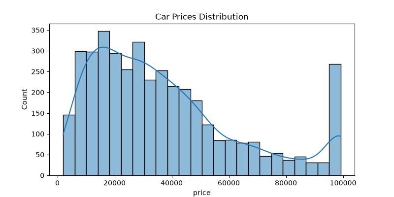
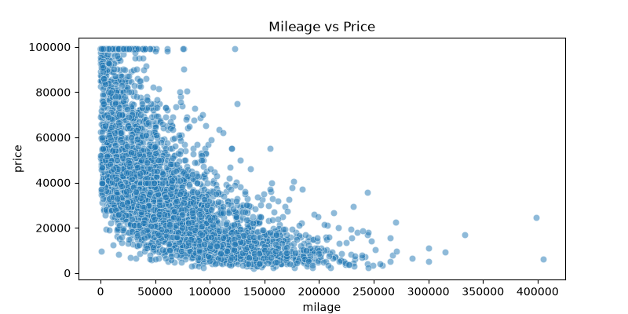
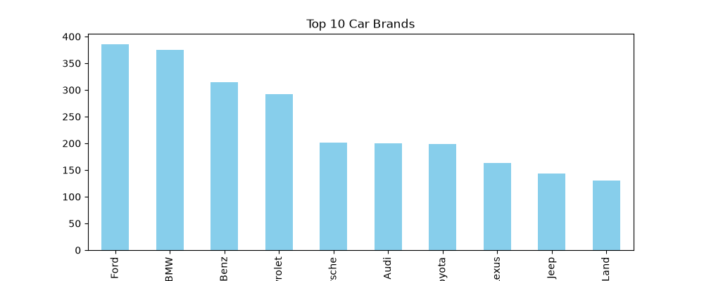

# Used-Car Price Data Pipeline

This is the data cleaning and engineering part of a used-car price prediction project. 

The raw dataset from Kaggle was pretty messy—it had prices and mileages stored as strings with text symbols, missing values scattered around, and vehicle engine specs mashed together into single, unorganized text blocks. 

I built this pipeline to automate the entire cleanup process, parse out the useful features, handle outliers, and export a clean, structured CSV that is ready to be fed straight into a machine learning model.

## The Dataset
I used the [Used Car Price Prediction Dataset](https://www.kaggle.com/datasets/taeefnajib/used-car-price-prediction-dataset) from Kaggle. 

What the Code Actually Does

### 1. Feature Extraction via Regex
The `engine` column contained mixed text like `300.0HP 3.0L V6 Cylinder Engine`. To make this data usable for an ML model, I used regular expressions (Regex) to extract two distinct numerical columns:
* `hp` (Horsepower)
* `liters` (Engine displacement)
After pulling this data out, I dropped the original messy `engine` column.

### 2. Smart Missing Value Imputation
Instead of just filling missing horsepower or engine liters with a generic average (which would ruin the data accuracy), I used a **3-tier hierarchical fallback** strategy using Pandas `groupby`:
* First, it tries to fill the missing value with the **median of that exact Car Brand and Model**.
* If that specific model data doesn't exist, it falls back to the **overall Brand median**.
* If the brand is completely missing, it falls back to the **global dataset median**.

### 3. Data Cleaning & Encoding
* Stripped out currency symbols, commas, and text from `price` and `milage` so they could be converted into clean integers.
* Filtered out random typos in the `fuel_type` column by matching them against a valid list of fuels, filling any remaining gaps with the most common fuel type (mode).
* Converted the `accident` and `clean_title` history columns into clean binary flags (`1` for yes, `0` for no) so a model can understand them.

### 4. Handling Outliers (IQR Method)
Used car prices have a massive spread due to rare luxury cars or heavily damaged vehicles. To keep future machine learning models from getting heavily skewed, I applied the **Interquartile Range (IQR) method** to cap extreme price outliers at the upper and lower boundaries ($1.5 \times IQR$).

### 5. Automated Visualizations
Every time the script runs, it spins up `matplotlib` and `seaborn` to output three quick exploratory charts:
* A distribution curve of car prices.
* A scatter plot comparing Mileage vs Price.
* A bar chart showing the Top 10 Car Brands in the dataset.

#### 6. Generated EDA Charts:




## Project Structure

* `main.py` - The main Python script with all the cleaning logic.
* `data.csv` - The raw, unedited Kaggle dataset.
* `cleaned_cars_data.csv` - The final, polished output file.
* `requirements.txt` - Python libraries needed to run the project.
* `images/` - Directory containing the automatically generated EDA plots.

---

## How to Run It

1. Clone the repo:
   ```bash
   git clone https://github.com
   cd Used-Car-Price-Pipeline
   ```

2. Install the required libraries:
   ```bash
   pip install -r requirements.txt
   ```

3. Run the script:
   ```bash
   python main.py
   ```
